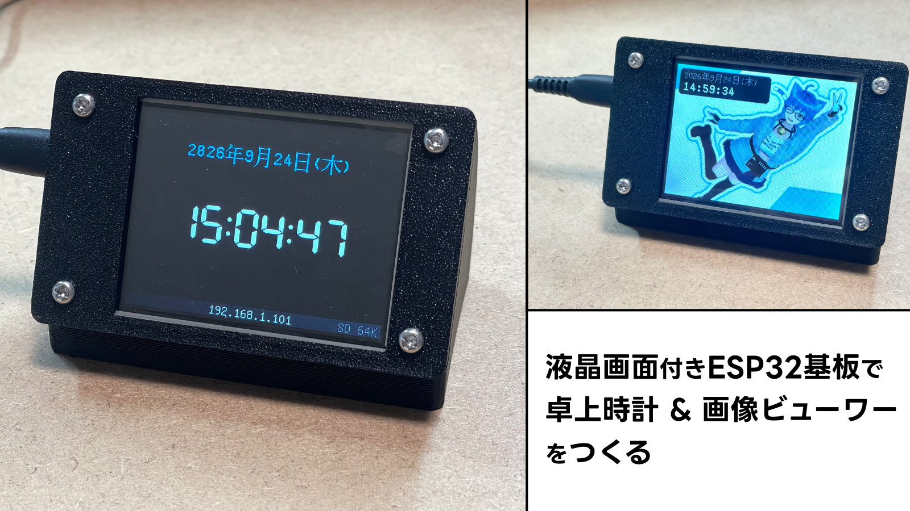

# CYD 情報ステーション



Cheap Yellow Display（ESP32-2432S028 相当）をデスクに置く情報表示デバイスにするスケッチです。

- NTP同期の時計（年・月・日・曜日・時・分・秒）
- WiFi設定はUSBシリアル経由
- mDNS（既定 `http://cyd-station.local/`）
- HTTPサーバー：外部からJPEG画像を受け取って表示
- ブラウザ用アップロードUI（アスペクト比を保ったクロップ → 320x240のJPEGで送信）
- microSDの `Album/` 以下のJPEGスライドショー
- 画面タップでメニュー（画像+時計⇄時計のみ、時計表示ON/OFF、接続用QR、スライドショー開始/停止）
- 画面下端に常時ステータスバー（NTP同期状態、IPアドレス、SD有無、空きヒープ）

起動時は、microSDに `/last.jpg`（最後にアップロードされた画像）があれば**画像+時計**、
なければ**時計のみ**を表示します。メニューからいつでも切り替えられます。

## ハードウェア / ピン配置

| 用途 | ピン |
|---|---|
| LCD ILI9341（SPI2/HSPI） | SCK 14 / MOSI 13 / MISO 12 / CS 15 / DC 2 / RST なし / BL 21 |
| microSD（SPI3/VSPI） | SCK 18 / MISO 19 / MOSI 23 / CS 5 |
| タッチ XPT2046（ソフトSPI） | CLK 25 / MOSI 32 / MISO 39 / CS 33 / IRQ 36 |
| RGB LED（アクティブLow） | R 4 / G 16 / B 17（起動時に消灯） |

ESP32で自由に使えるSPIホストはHSPI/VSPIの2つだけですが、SPIデバイスは3つあります。
速度が要るLCD（SPI2/HSPI）とmicroSD（SPI3/VSPI）にハードウェアSPIを割り当て、低速で構わない
XPT2046は `touch_xpt2046.cpp` のソフトSPI（ビットバン）で駆動しています。
PENIRQ（GPIO36）がLowのときだけ読みに行くので、ポーリングのコストはほぼゼロです。
LCDの14/12/13/15、SDの18/19/23/5はそれぞれSPI2/SPI3のネイティブ（IO_MUX）ピンなので、
GPIOマトリクスを経由せず最高速で動きます。

## ビルド

Arduino IDE の場合：

- ボード: **ESP32 Dev Module**
- **Partition Scheme: `Huge APP (3MB No OTA/1MB SPIFFS)`** ← 必須
  （WiFi + WebServer + mDNS + LovyanGFX + 日本語フォントで約2.4MB。既定の
  1.25MBスロットには収まりません）
- 必要ライブラリ: LovyanGFX

arduino-cli の場合：

```
arduino-cli compile --fqbn esp32:esp32:esp32:PartitionScheme=huge_app cyd_station
arduino-cli upload  --fqbn esp32:esp32:esp32:PartitionScheme=huge_app -p COM5 cyd_station
```

スケッチブックに汎用の `SD` ライブラリがあると `SD.h` の候補が2つになりますが、
アーキテクチャが一致するESP32コア側（`packages/esp32/.../libraries/SD`）が選ばれます。
ビルドログの `ResolveLibrary(SD.h)` で確認できます。

## 初期設定（USBシリアル 115200bps）

```
wifi MySSID MyPassword        # 空白を含む場合は wifi "My SSID" "My Pass"
status
```

`help` で全コマンドが出ます。

| コマンド | 説明 |
|---|---|
| `help` | コマンド一覧 |
| `status` | WiFi/IP/NTP/SD/メモリ/モードを表示 |
| `wifi` | 保存済みSSIDを表示 |
| `wifi <SSID> <PASS>` | WiFi設定を保存して再接続 |
| `scan` | 周囲のAPをスキャン |
| `host <name>` | mDNSホスト名（既定 `cyd-station`、要再起動） |
| `tz <POSIX TZ>` | タイムゾーン（既定 `JST-9`） |
| `ntp <server>` | NTPサーバ（既定 `ntp.nict.jp`） |
| `rotate <1\|3>` | 画面の向き（変更後は `calib` を再実行） |
| `invert <on\|off>` | 色反転（個体差で色がおかしい場合） |
| `clock <on\|off>` | 時計表示 |
| `slide <sec>` | スライドショー間隔（既定10秒） |
| `mode <clock\|image\|slideshow>` | 表示モード切替 |
| `sd` | SDを再マウントして `Album/` を再スキャン |
| `calib` | タッチパネルの3点校正（左上→右上→左下） |
| `touchraw` | タッチ生値を5秒間表示（デバッグ用） |
| `reboot` / `erase` | 再起動 / 設定初期化 |

設定はすべてNVSに保存されます。**初回は `calib` でタッチ校正を実行してください。**

## HTTP API

| メソッド | パス | 説明 |
|---|---|---|
| GET | `/` | アップロードUI |
| POST | `/upload` | multipart（フィールド名 `image`）でJPEGを受け取り表示 |
| GET | `/status` | JSONで状態を返す |
| GET | `/image` | 現在保持しているJPEGを返す |
| POST | `/mode?m=clock\|image\|slideshow` | モード切替 |
| POST | `/rescan` | SD再マウント + `Album/` 再スキャン |

コマンドラインから送る例：

```
curl -F "image=@test.jpg" http://cyd-station.local/upload
curl http://cyd-station.local/status
```

受信バッファは100KBです。それを超える画像は `413` を返します。
受け取った画像はSDがあれば `/last.jpg` に保存され、次回起動時にRAMへ復元されて
そのまま表示されます。SDが無い場合はRAM上だけに保持するため電源断で消えます。

## スライドショー

microSDのルートに `Album/` を作り、JPEGファイルを置きます（ファイル名昇順、最大256枚）。
メニューの「スライドショー: 開始」で再生します（自動開始はしません）。

- 画像は **320x240** を想定しています。それより大きい画像は左上から320x240分だけ表示されます。
- **ベースラインJPEGのみ対応**です。プログレッシブJPEGはデコーダ（tjpgd）が非対応のため
  スキップし、シリアルにログを出します。アップロードUIが生成するJPEGはベースラインです。

## ファイル構成

| ファイル | 役割 |
|---|---|
| `cyd_station.ino` | setup/loop、モード状態機械 |
| `LGFX_CYD.hpp` | LovyanGFXのボード設定とピン定義 |
| `touch_xpt2046.*` | ソフトSPIのXPT2046ドライバと校正 |
| `config_store.*` | NVS（Preferences）への設定保存 |
| `serial_console.*` | USBシリアルのコマンド処理 |
| `net.*` | WiFi / NTP / mDNS |
| `web_server.*` | HTTPサーバー |
| `web_ui.h` | アップロードUIのHTML（PROGMEM） |
| `ui.*` | 時計・ステータスバー・メニュー・QR描画 |
| `slideshow.*` | microSDと `Album/` のスライドショー |

## メモ

- JPEGバッファ（100KB）はWiFi起動より前に一度だけ確保しています。WiFi初期化後は
  ヒープが断片化して100KBの連続確保に失敗することがあるためです。
- PSRAMがないため、時計描画にスプライトは使わず `setTextColor(前景, 背景)` で
  背景ごと上書きしてちらつきを抑えています。
- QRコードはLovyanGFX組み込みの `lcd.qrcode()` を使っています（外部ライブラリ不要）。
  Androidでは `.local` の名前解決が不安定なため、QRにはIPアドレスのURLを埋めています。

## ライセンス

MIT License (C) 2026 Mitsumine Suzu (verylowfreq)
